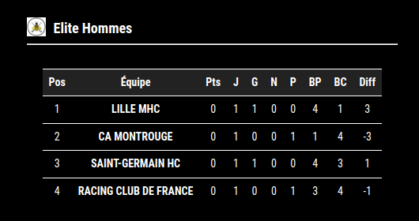
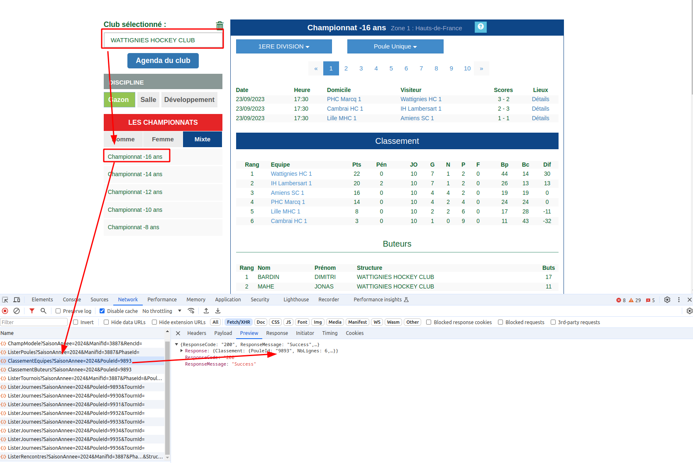

# MMM-FieldHockey-FFH

This is a module for the [MagicMirror](https://magicmirror.builders/)


In France, there is a field hockey championship. 
Match results, scores, and top scorers are provided on the [FFH website](https://www.ffhockey.org/championnat/calendrier-et-resultats.html). 
This module offers to display the teams' rankings.



## Install

```
cd MagicMirror/modules
git clone https://github.com/mmourcia/MMM-FieldHockey-FFH.git
cd MMM-FieldHockey-FFH
npm i
```

## Config

```json
{
    module: "MMM-FieldHockey-FFH",
    position: "bottom_right",
    config: {
        updateInterval: 3600000, // 1 hour
        rotationInterval: 20000, // 10 seconds
        poules: [
            {
                SaisonAnnee: 2024,
                PouleId: 10483,,
                PouleTitle: "Elite Hommes",
                PouleLogo: "./modules/MMM-FieldHockey-FFH/resources/elite-hommes.png"
            },
            {
                SaisonAnnee: 2024,
                PouleId: 9893,
                PouleTitle: "U16 WHC",
                PouleLogo: "./modules/MMM-FieldHockey-FFH/resources/u16-whc.png"
            }
        ],
        apiUrl: "https://championnats.ffhockey.org/rest2/Championnats/ClassementEquipes"
    }
}
```

## Getting "PouleId"

To get the PouleId you would like to display informations about : 

* Browse https://www.ffhockey.org/championnat/calendrier-et-resultats.html
* Open the dev console with F12
* Choose a club, a championship
* In network tab of the dev console, click on the route `ClassementEquipes`
* Get the PouleId




